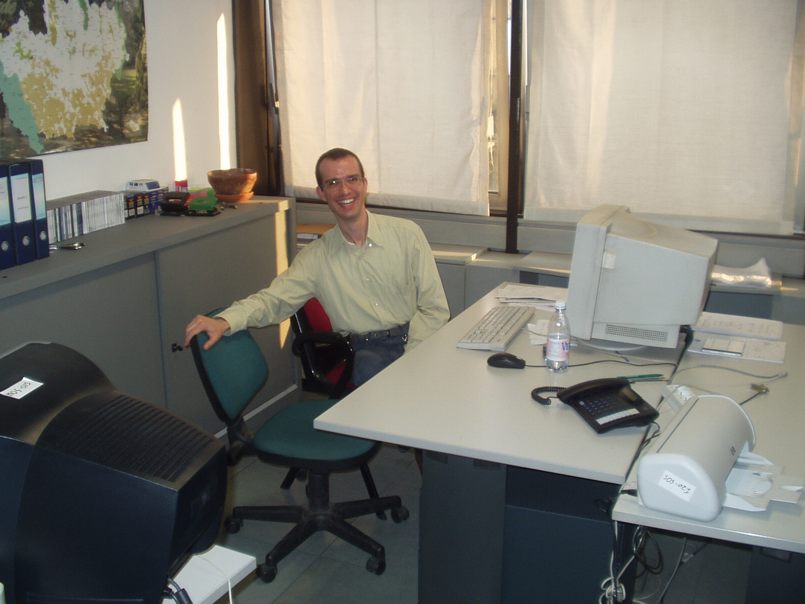

# Software Consultant for Analytical Data Processing

last updated 2020-12-29

<ul class="nav">
<li class="nav-active"><a href="./">about</a></li>
<li><a href="./employment.md">employment</a></li>
</ul>

*Fig. 0: Historical picture showing me happy with an apparently invisible presence on my side (the Unknown Colleague).*

## about

Mostly and preferably in telco domain, focusing on data-intensive back-end applications. \
Implementing analytical transformations (i.e. deriving data from relationships among data), also in bulk and continuous processing. \
Long-term commitment to constructing durable software (as opposed to throw-away stuff). \
Oriented towards projects rather than school-like tasks.

While experienced, I am no rentier and my goal is not to endlessly repeat what I already know, neither do I think that is the best way to employ skilled people. \
On the contrary there is a capacity for evolving, using what we know to do what we do not yet know. \
I am driven by my interest in the subject matter and in new things, while always keeping in mind the usefulness for others (it is a job).

This is proven by a sequence of long term cycles:

* current cycle: Scala/FP, Big Data processing (Spark, Kafka), SQL
    + Functional Programming paradigm
    + Odersky courses progfun1 and progfun2 (including all assignments) passed (it is not a TV series!)
    + Core language, sbt, Standard Library
    + Additional libraries: ZIO and its ecosystem (including zio-kafka and zio-test), circe, doobie, FastParse, etc.
    + This language has been my access path to several Big Data platforms: Kafka, Spark, Flink, etc.
    + Spark: SQL and DataFrame API, with DeltaLake library

* all-encompassing cycle: UNIX and Linux
    + Both as a development platform and an operating environment
    + Including modern tools, e.g., git, Docker

* previous cycle: Oracle
    + Analytic SQL
    + Serious SQL tuning (no quackery)
    + Methodical (using measures and statistics) database/application performance diagnostics and troubleshooting

* hystorical (but qualifying), archived cycle: C++
    + object-oriented and generic (i.e. based on type parametrization) paradigms
    + STL (Standard Template Library)

* Studies
    + Master’s Degree in Mathematics
    + Including exams on Statistics
    + Dissertation on type parametrization-based programming in C++

Problem- and concept- and question- driven, self-learner, self-starter and self-motivating. \
Deductive, rather than repetitive. Fundamentally capable of approaching new (unseen) things. \
Evolutionary, both on projects and myself. \
Team player, collaborative person (rather than competitive), constructive, willing to share knowledge with receptive people.
